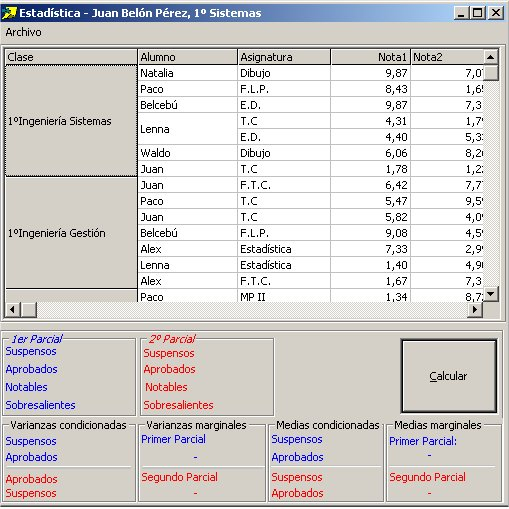



## Calculos estadisticos \| Simple Estadistic compute

### Description

Calculos estadisticos simples
 
### More Info
 

             |
---                |---
**Submitted On**   |2002-10-25 22:32:08
**By**             |[yeagerin](https://github.com/Planet-Source-Code/PSCIndex/blob/master/ByAuthor/yeagerin.md)
**Level**          |Beginner
**User Rating**    |5.0 (10 globes from 2 users)
**Compatibility**  |VB 5\.0, VB 6\.0
**Category**       |[Coding Standards](https://github.com/Planet-Source-Code/PSCIndex/blob/master/ByCategory/coding-standards__1-43.md)
**World**          |[Visual Basic](https://github.com/Planet-Source-Code/PSCIndex/blob/master/ByWorld/visual-basic.md)
**Archive File**   |[Calculos\_e1599336102003\.zip](https://github.com/Planet-Source-Code/yeagerin-calculos-estadisticos-simple-estadistic-compute__1-46096/archive/master.zip)

